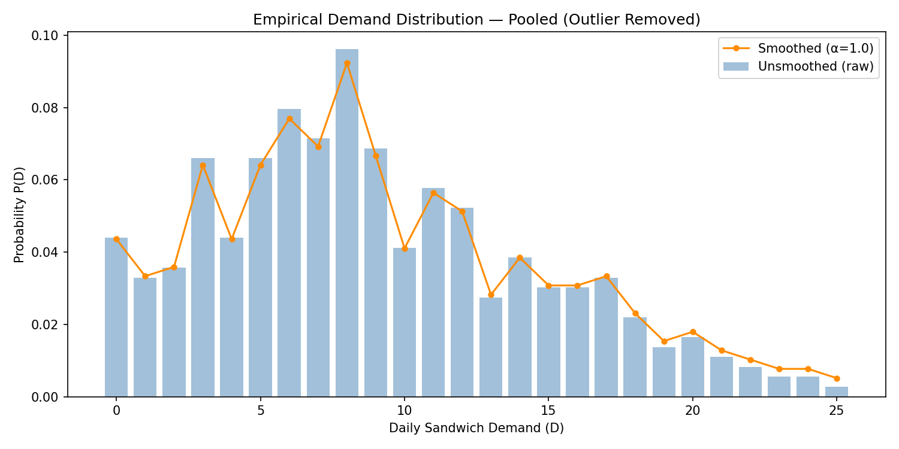
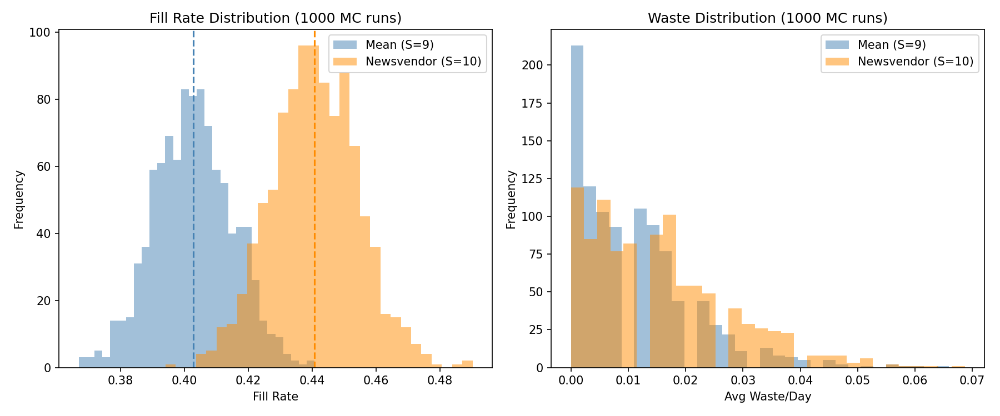
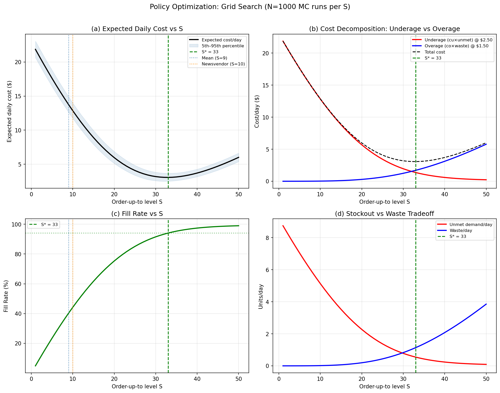
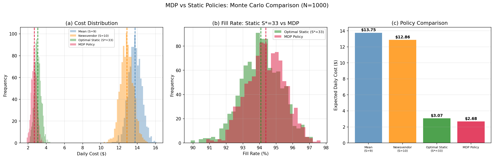
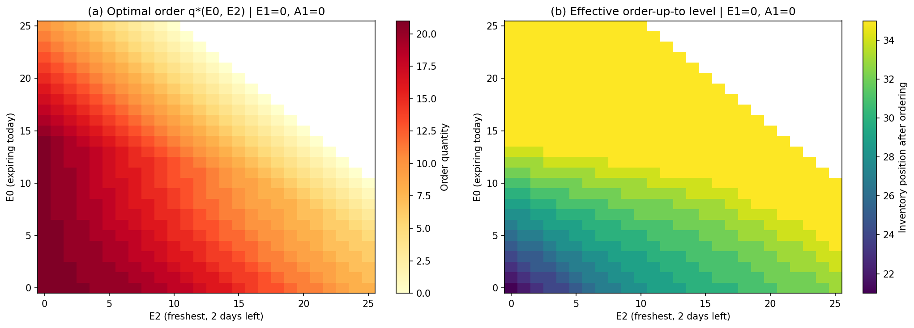
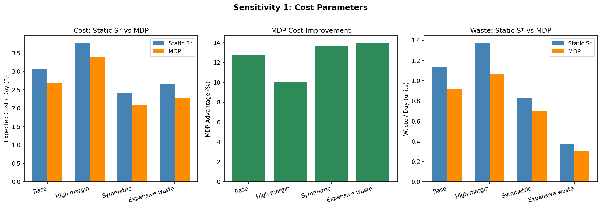
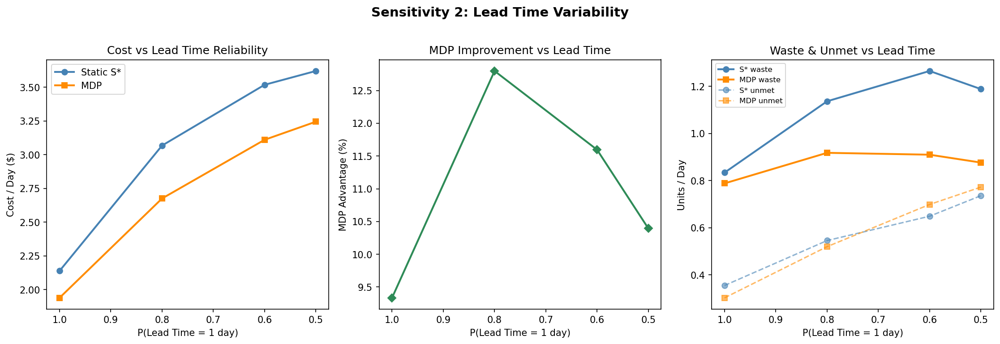
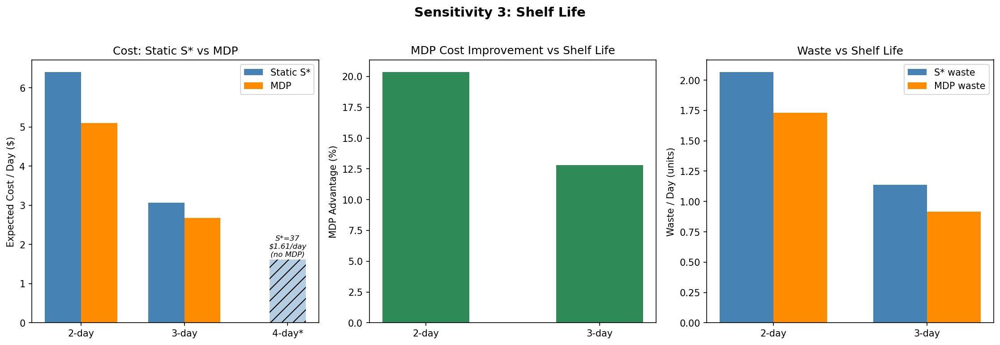

# Probabilistic Inventory Optimization for Perishable Food Items

This project models an inventory control problem for perishable food items under uncertain demand, stochastic lead times, stockouts, and waste. The goal is to compare simple ordering rules against optimized policies using simulation, grid search, and a Markov Decision Process (MDP).

The project was developed as an academic Operations Research project and is presented here as a public portfolio repository focused on supply chain analytics, inventory optimization, and decision science.

---

## Project Motivation

Perishable food inventory creates a difficult tradeoff:

- Ordering too little causes stockouts and unmet demand.
- Ordering too much causes waste.
- Demand is uncertain and right-skewed.
- Lead times may vary.
- Simple rules based only on average demand can perform poorly.

This project studies that tradeoff using sandwich demand data and compares several inventory policies:

1. Mean-demand ordering policy
2. Newsvendor-style policy
3. Optimized static order-up-to policy
4. Dynamic MDP policy

---

## Key Result

The project shows that simple policies perform poorly under uncertain and skewed demand, while optimized policies substantially improve service levels and reduce expected daily cost.

| Policy | Cost/day | Fill Rate | Waste/day | Unmet/day |
|---|---:|---:|---:|---:|
| Mean Policy, S = 9 | $13.75 | 40.2% | 0.01 | 5.49 |
| Newsvendor Policy, S = 10 | $12.86 | 44.2% | 0.02 | 5.13 |
| Optimized Static Policy, S* = 33 | $3.07 | 94.1% | 1.14 | 0.55 |
| MDP Policy | $2.68 | 94.4% | 0.92 | 0.52 |

The MDP policy achieved the lowest simulated daily cost while maintaining a high fill rate and reducing waste compared with the optimized static policy.

---

## Methods Used

- Demand modeling
- Empirical probability mass function estimation
- Monte Carlo simulation
- Baseline inventory policy comparison
- Grid search over order-up-to levels
- Markov Decision Process formulation
- Value iteration
- Sensitivity analysis
- Visualization of policy behavior and performance

---

## Repository Structure

```text
inventory-optimization-mdp/
│
├── data/
│   ├── processed/
│   │   ├── sandwich_daily_demand.csv
│   │   ├── sandwich_daily_demand_cleaned.csv
│   │   ├── sandwich_daily_by_weekday.csv
│   │   └── sandwich_P_of_D.csv
│   │
│   └── raw/
│       └── README.md
│
├── docs/
│   └── OR7230_Report.pdf
│
├── notebooks/
│   ├── 01_data_cleaning.ipynb
│   ├── 02_demand_distribution.ipynb
│   ├── 03_demand_validation.ipynb
│   ├── 04_baseline_simulation.ipynb
│   ├── 05_policy_optimization.ipynb
│   ├── 06_mdp.ipynb
│   └── 06b_sensitivity.ipynb
│
├── outputs/
│   ├── figures/
│   └── tables/
│
├── .gitignore
├── README.md
└── requirements.txt
```

---

## Notebook Workflow

The notebooks are organized as a sequential modeling pipeline:

| Notebook | Purpose |
|---|---|
| `01_data_cleaning.ipynb` | Prepares the demand data for analysis |
| `02_demand_distribution.ipynb` | Builds the empirical demand distribution |
| `03_demand_validation.ipynb` | Validates pooled vs. weekday demand modeling |
| `04_baseline_simulation.ipynb` | Simulates baseline inventory policies |
| `05_policy_optimization.ipynb` | Runs grid search for optimized static policies |
| `06_mdp.ipynb` | Formulates and solves the MDP using value iteration |
| `06b_sensitivity.ipynb` | Tests policy performance under different cost, lead time, and shelf-life assumptions |

---

## Selected Visuals

### Demand Distribution



The observed demand distribution is right-skewed, which helps explain why simple mean-based ordering can underperform.

---

### Baseline Policy Comparison



Baseline policies based on mean demand and newsvendor logic provide limited fill-rate performance under the modeled demand setting.

---

### Static Policy Grid Search



A grid search over static order-up-to policies identifies a much stronger fixed policy than the baseline rules.

---

### MDP Policy Performance



The MDP policy improves expected daily cost relative to the optimized static policy while maintaining a high fill rate.

---

### MDP Policy Structure



The MDP policy adapts ordering decisions based on the inventory state instead of using a single fixed order-up-to level.

---

### Sensitivity Analysis







Sensitivity analysis tests how policy performance changes under different cost structures, lead-time assumptions, and shelf-life settings.

---

## Model Comparison Summary

The optimized static policy and MDP policy both dramatically improve over simple baseline rules.

| Policy | Main Idea | Result |
|---|---|---|
| Mean policy | Order based on average demand | Low fill rate and high unmet demand |
| Newsvendor policy | Balance underage and overage costs | Slight improvement over mean policy |
| Optimized static policy | Search for best fixed order-up-to level | Large improvement in fill rate and cost |
| MDP policy | Dynamically order based on inventory state | Best overall cost among tested policies |

---

## Sensitivity Analysis Summary

The MDP policy remained competitive across multiple experimental settings.

| Dimension | Tested Scenarios |
|---|---|
| Cost structure | Base, high margin, symmetric, expensive waste |
| Lead time | Deterministic, base, noisier, coin-flip arrival |
| Shelf life | 2-day, 3-day, and 4-day shelf-life settings |

In most tested scenarios, the MDP policy reduced expected daily cost relative to the optimized static policy.

---

## How to Run

Clone the repository:

```bash
git clone https://github.com/AryanAnandGupta/inventory-optimization-mdp.git
cd inventory-optimization-mdp
```

Install dependencies:

```bash
pip install -r requirements.txt
```

Open Jupyter Notebook:

```bash
jupyter notebook
```

Run the notebooks in order from `notebooks/01_data_cleaning.ipynb` through `notebooks/06b_sensitivity.ipynb`.

---

## Data Note

The original raw dataset is not included in this repository until redistribution permissions are verified.

Processed project data used for the modeling workflow is included in `data/processed/`.

---

## Project Limitations

This is an academic project and should be interpreted as a modeling and decision-analysis exercise, not as a deployed production inventory system.

Limitations include:

- Results depend on the processed demand data and modeling assumptions.
- Demand is estimated from historical observations rather than a live forecasting system.
- Cost parameters are scenario assumptions used for analysis.
- The MDP is designed for the project setting and is not a general production optimizer.

---

## Skills Demonstrated

- Operations Research
- Inventory Optimization
- Supply Chain Analytics
- Stochastic Modeling
- Monte Carlo Simulation
- Markov Decision Processes
- Value Iteration
- Python Data Analysis
- Policy Evaluation
- Sensitivity Analysis
- Decision Science Communication

---

## Author

Aryan Anand Gupta  
M.S. Operations Research, Northeastern University

Project focus: supply chain analytics, inventory optimization, logistics analytics, and applied decision science.
